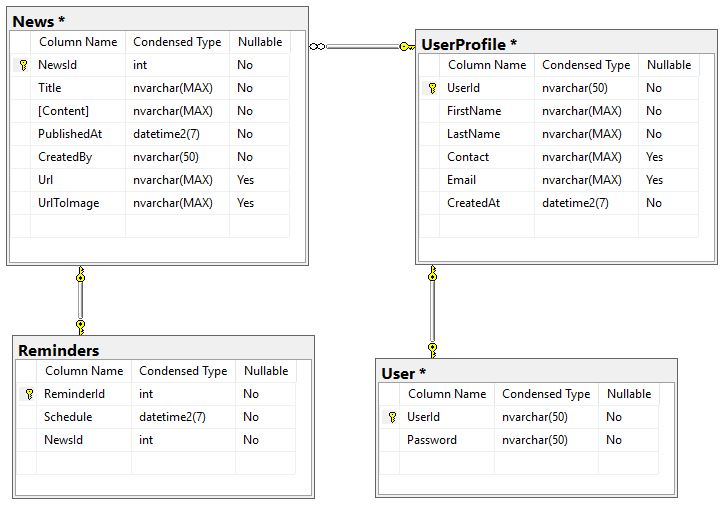
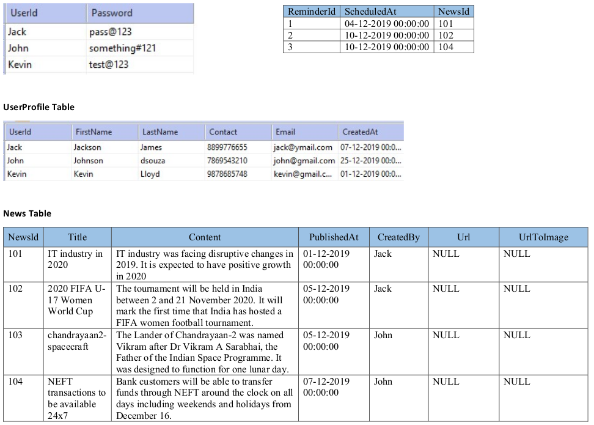

 

## Seed code - Boilerplate for RDBMS - Assignment

### Assignment Instructions (Must be followed mandatorily)

- *Read the given set of questions and solve them by writing queries using MySQL*
- *Fork the above boilerplate and clone into your local machine*
- *The Solution has to be written in db.sql file*
- *Queries should be wriiten in MySQL syntax*
- *Do not use any IDE for generating the SQL queries. You need to write them manually*
- *Do not give spaces at the beginning of the Query*
- *Do not use the schema name in Queries. ex*

        create table 'schemaname'.'Test'(user_id int primary key ....);
            
            instead write as below
        
        create table Test(user_id int primary key ....);

# Seed code - Boilerplate for step-0 News App Assignment
​
## Assignment Step Description
​
Read the given set of questions and solve them by writing queries using MySQL.
​
The estimated effort to complete this assignment is 2 - 3 hours
​
### Things to do
​
- Fork this boilerplate.
- Clone the forked boilerplate.
- Create sql queries based on the problem statement and expected solution.
- Ensure all test cases pass locally.
- Push the changes into your repository.
- Submit the assignment in Hobbes for evaluation and share score with your mentor.
​
​
### Problem Statement
​
News-app is used to explore and read the news. It is also used to manage news in your watchlist to read later.
Create the necessary DB schema (MySQL) including tables, relationships and add sample data into each table.
​
### Expected solution
​
- The tables for News, UserProfile, User and Reminders should get created, as per the Database diagram image. 
- The records for these tables should get inserted as per the snapshot shared with the boilerplate.
- Design query statements as per the requirements given below
​
### Database diagram
** Create tables as per the below entity relationship

​
**Insert the rows into the created tables as per below snapshot**

1. Retreive all the user profiles joined on or after 10-Dec-2019.
2. Retreive the details of user 'Jack' along with all the news created by him.
3. Retreive all details of the user who created the News with newsId=103.
4. Retreive the details of all the users who have not added any news yet.
5. Retreive the newsid and title of all the news having some reminder.
6. Retreive the total number of news added by each user.
7. Update the contact number of userId='John' to '9192939495'.
8. Update the title of the newsId=101 to 'IT industry growth can be seen in 2020'.
9. Remove all the reminders belonging to the news created by Jack.
10. Write a query to set a reminder for a particular news (Use Reminder and News tables - insert statement)

	
### Note

1. This assignment is based on RDBMS concepts using MSQL platform, All the queries will run inside MYSQL workbench therofore mysql is required to work.
2. Successful execution of queries locally inside MYSQL platform are mandatory to accept the solution of this assignment.
